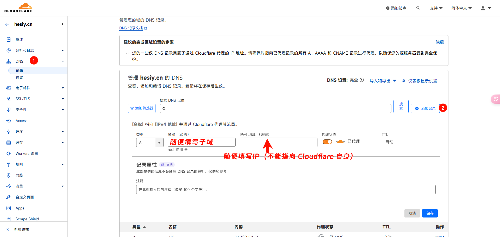
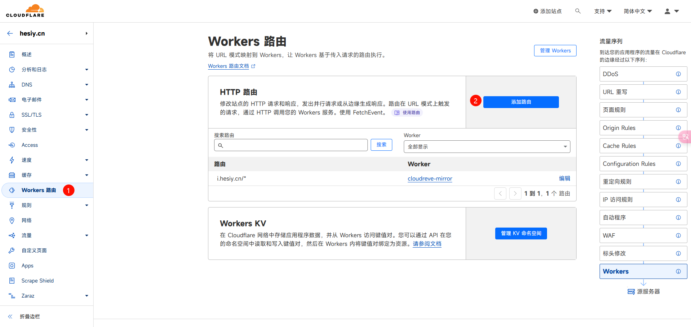
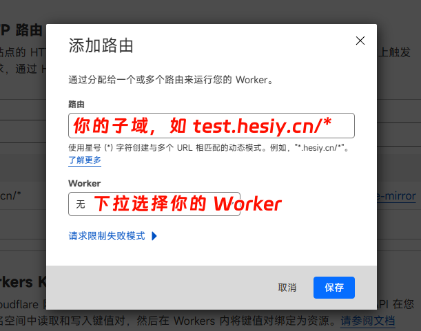

<h1 align="center">TGTalk FrontEnd</h1>

As the name suggests, this is a front end to TGTalk.

This project originated from [ChenYFan](https://github.com/ChenYFan). Without him, this project would not exist.

本项目起源于 [ChenYFan](https://github.com/ChenYFan)，如果没有他，这个项目不可能存在！

本项目由键盘和 AI 自动生成，本人没有义务对该项目引发的任何争议负责任

English | [中文（简体）](#chinese)

## Usage the project(CDN)

> If you have the ability, I recommend you write your own styles and templates, so that you can better control the display effect, in addition to this, you can better avoid style pollution (limit the style effect to the mount container)

Add the style file

```html
<link
  rel="stylesheet"
  href="https://registry.npmmirror.com/@floatsheep/tg-talker/latest/files/dist/main.css"
/>
```

Add the init script and main script

```html
<script>
  window.G_CONFIG = {
    api: "https://tgtalk.api.eurekac.cn", // A api that you deployed
    ref: "g-container", // A container that you want to mount it
    template: "default", // Choose "custom" or "default"
    zoom: true, // Enable Medium-Zoom
  };
</script>
<script src="https://registry.npmmirror.com/@floatsheep/tg-talker/latest/files/dist/index.js"></script>
<div id="g-container"></div> <!--You can choose the id-->
<button id="load-more">More</button> <!--A load more button-->
```

## Use your template

If you want to use your template, you can choose custom in the template setting

And then, you should refer to the documentation of handlebars to add a template and make its id template

Just like this:

```html
<script id="template" type ="text/x-handlebars-template">
...Your template
</script>
<script>
  window.G_CONFIG = {
    ...Your config
    template: "custom"
  }
</script>
```

## Open Handlebars Helper

These are the Handlebars Helpers open in this project, which may help you if you want to write your own templates:

|     Name     |                           Way                           |                            Effect                            |
| :----------: | :-----------------------------------------------------: | :----------------------------------------------------------: |
| tagExtractor |                   tagExtractor(text)                    |               Traverse and return tag in text                |
| tagConverter |            tagConverter(text, renderTagList)            |               Convert a tag to tags in tagList               |
|   contains   |    contains(str, sub)<br />(contains text "Channel")    |                Determine if str includes sub                 |
|     not      |    not(value)<br /> (not (contains text "Channel"))     | Returns the opposite of a given value (true -> false / false -> true), can be used with #if |
| replaceImage | replaceImage(originalLink)<br />{{ replaceImage this }} |                     Overwrite Image Link                     |
| replaceTime  |    replaceTime(timestamp)<br />{{replaceTime time}}     |               Rewrite timestamp to local time                |
|  maskRender  |        maskRender(text)<br />{{maskRender text}}        |        Convert Telegram mask in text to plugin-heimu         |
|     add      |                        add(a, b)                        |                   Add a to b (number type)                   |

## Chinese

> 如果你有能力，我更推荐你自己编写样式和模板，这样你能更好控制显示效果，除此之外，你还能更好的避免样式污染（将样式生效范围限定在挂载容器之内）

添加样式文件

```html
<link
  rel="stylesheet"
  href="https://registry.npmmirror.com/@floatsheep/tg-talker/latest/files/dist/main.css"
/>
```

添加初始化脚本和主要脚本

```html
<script>
  window.G_CONFIG = {
    api: "https://tgtalk.api.eurekac.cn", // 你部署的 API
    ref: "g-container", // 你想要挂载的容器
    template: "default", // 选择 "custom" 或者 "default"
    zoom: true, // 启用 Medium-Zoom（点击图片放大）
  };
</script>
<script src="https://registry.npmmirror.com/@floatsheep/tg-talker/latest/files/dist/index.js"></script>
<div id="g-container"></div> <!--你可以更改ID-->
<button id="load-more">加载更多</button> <!--加载更多按钮-->
```

## 制定你的模板

如果你想要使用你的 Handlebars 模板，你可以在模板设置中选择 custom

然后你应该参照 Handlebars 的官方文档创建一个 ID 为 template 的模板，就像下面这样：

```html
<script id="template" type ="text/x-handlebars-template">
...你的模板内容
</script>
<script>
  window.G_CONFIG = {
    ...你的配置
    template: "custom"
  }
</script>
```

## 开放的 Handlebars Helper

这些是本项目中开放的 Handlebars Helper，如果你要编写自己的模板，或许会对你有所帮助：

|     名字     |                        使用方法                         |                             效果                             |
| :----------: | :-----------------------------------------------------: | :----------------------------------------------------------: |
| tagExtractor |                   tagExtractor(text)                    |                   遍历并返回 text 中的 tag                   |
| tagConverter |            tagConverter(text, renderTagList)            |               转换 a 标签为 tagList 中的 tags                |
|   contains   |    contains(str, sub)<br />(contains text "Channel")    |                   判断 str 中是否包括 sub                    |
|     not      |    not(value)<br /> (not (contains text "Channel"))     | 返回给定值的相反值（true -> false / false -> true），可与 #if 连用 |
| replaceImage | replaceImage(originalLink)<br />{{ replaceImage this }} |                         覆写图片链接                         |
| replaceTime  |    replaceTime(timestamp)<br />{{replaceTime time}}     |                     重写时间戳为本地时间                     |
|  maskRender  |        maskRender(text)<br />{{maskRender text}}        |          转换文字中的 Telegram 遮罩为 plugin-heimu           |
|     add      |                        add(a, b)                        |                  将 a 与 b 相加（数字类型）                  |


## 部署 API

访问 [Gist](https://gist.github.com/ChenYFan/4e88490212e3e08e06006cf31140cd3f)，复制其中所有代码

进入 [Cloudflare 仪表盘](https://dash.cloudflare.com)

选择创建应用程序 -> 创建 Worker -> 修改名称（部署）-> 编辑代码

在其中粘贴你复制的所有代码，并且修改 ChannelName 为你的频道名称，部署并访问 Worker 查看是否能正确返回内容

> ！如果不能返回内容，请将 nextBefore 一行更改为 `Number((getDataFromTelegram.match(/data-before="([0-9]+)"/g) || ["0"])[0].match(/[0-9]+/g))`

接着你可以为你的 Worker 绑定一个域名







保存，然后将你绑定的域名填入配置中的 `api` 项即可